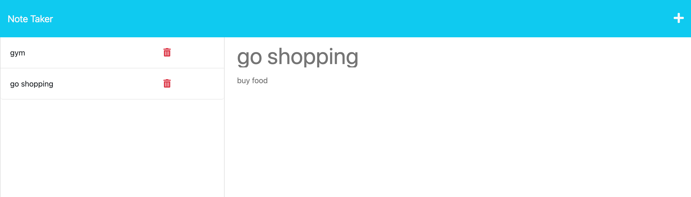

## Note-taker
 [](https://opensource.org/licenses/MIT)

[](https://nodejs.org/en) 

## Overview of Note-Taker
## User Story

```
AS A small business owner
I WANT to be able to write and save notes
SO THAT I can organize my thoughts and keep track of tasks I need to complete

```


## Acceptance Criteria
```
GIVEN a note-taking application
WHEN I open the Note Taker
THEN I am presented with a landing page with a link to a notes page
WHEN I click on the link to the notes page
THEN I am presented with a page with existing notes listed in the left-hand column, plus empty fields to enter a new note title and the note’s text in the right-hand column
WHEN I enter a new note title and the note’s text
THEN a "Save Note" button and a "Clear Form" button appear in the navigation at the top of the page
WHEN I click on the Save button
THEN the new note I have entered is saved and appears in the left-hand column with the other existing notes and the buttons in the navigation disappear
WHEN I click on an existing note in the list in the left-hand column
THEN that note appears in the right-hand column and a "New Note" button appears in the navigation
WHEN I click on the "New Note" button in the navigation at the top of the page
THEN I am presented with empty fields to enter a new note title and the note’s text in the right-hand column and the button disappears

```

## Table of Contents 

1. [Description](#description)
2. [Installation](#installation)
3. [Usage](#usage)
4. [Links](#links)
5. [Mock-up](#mock-up)
4. [Credits](#credits)
6. [Features](#features)


## Description
Note Taker is a application that can save data using express.js. As a developer, I can create notes for user to use in a timely manner.


## Installation
```
npm i
```

## Usage 
Open the terminal and run this command once all packages are installed
```
node server.js
```

## Links

[The URL of the Github repository](https://github.com/kathylopez97/Note-Taker)

[The Deployed Application from Heroku](https://note-taker24-4458bd8ca76c.herokuapp.com/)
## Mock-up


## Credits
- [Youtube](https://www.youtube.com)
- [W3school](https://www.w3schools.com)
- [License](https://shields.io/)
- [UUID](https://www.npmjs.com/package/uuid)


## Features
- CSS
- HTML
- Javascript
- Bootstrap